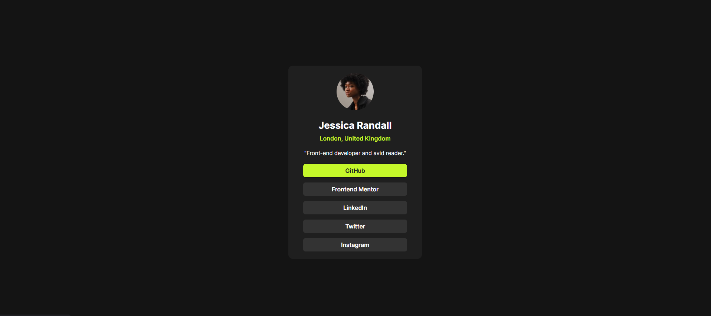

# Frontend Mentor - Social Links Profile

This is a solution to the [Social Links Profile Challenge](https://www.frontendmentor.io/challenges/social-links-profile-UG32l9m6dQ) on Frontend Mentor.

## 🔍 Overview

A responsive and accessible profile card that displays:

- Profile image
- Name and location
- Personal tagline
- Social media links with hover effects

## 🛠 Built with

- Semantic HTML5
- CSS3 (Flexbox, `clamp()`, and `@font-face`)
- CSS custom properties (`:root`)
- Responsive design (no media queries)

## 💡 What I Learned

- How to use `clamp()` for font responsiveness
- How to organize CSS using custom properties

## 📸 Screenshot

## ✨ Live Demo

[Live Site](https://mohamed-ahmed-137.github.io/social-links-profile/)

## 🔗 Author

- GitHub: [Mohamed-Ahmed-137](https://github.com/Mohamed-Ahmed-137)
- Frontend Mentor: [@Mohamed-Ahmed-137](https://www.frontendmentor.io/profile/Mohamed-Ahmed-137)
